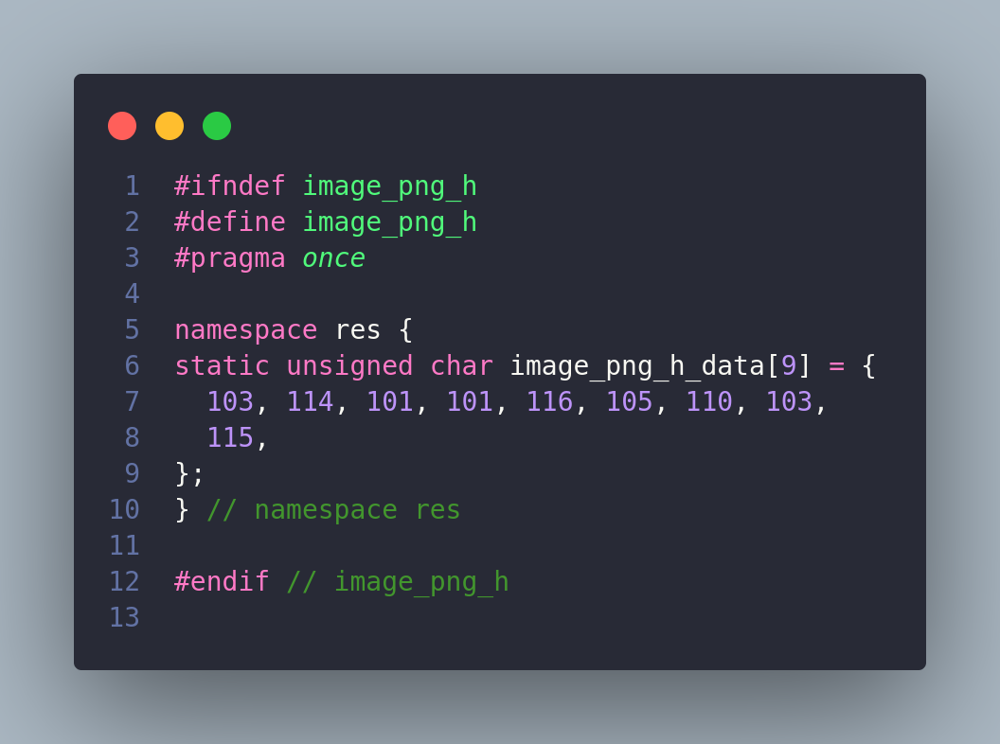

# Bully Resource Baker

wget-and-use tool to bake your resource into your C/C++ code

## Usage
### Downloading
```sh
wget https://raw.githubusercontent.com/Lexographics/bully/main/bully.rb
```

### Running bully
```sh
  ruby bully.rb --help

  ruby bully.rb   --help, -h                prints usage
  ruby bully.rb   --version                 prints version information
  ruby bully.rb   --ext {extension}         extension for generated files (default: .h)
  ruby bully.rb   --namespace {namespace}   namespace for generated files (default: )
  ruby bully.rb   --dir {directory}         directory to lookup resources (default: ./)
  ruby bully.rb   --always-generate         if present, will not check file modification dates
  ruby bully.rb   --recursive               checks for resources in {dir} recursively
```
<br>

- After running bully.rb, C/C++ header files will be generated from the files in the {dir}



### Config Files
Config files can be used to save configuration instead of typing them to console.
To use config file, create a file in working directory named `bully_config.yml`
```yml
  # example bully_config.yml file
  extension: .h
  namespace: res
  dir: res
  always_generate: false
  recursive: true
```
Note: Command line arguments will override config file